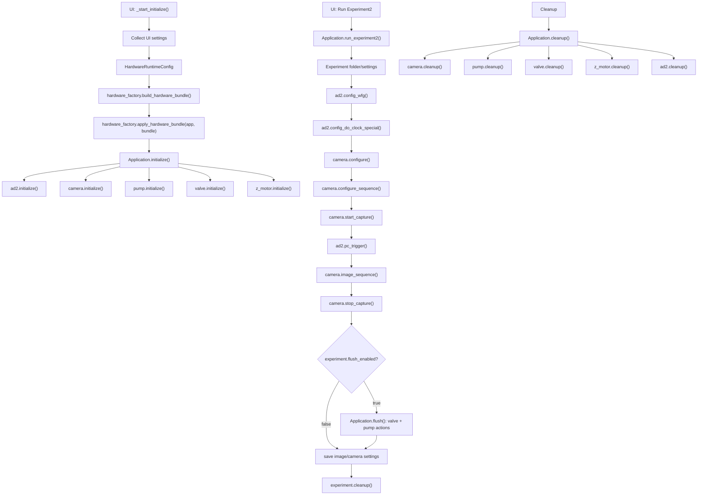

# Current Workflow Audit and Safety Boundary

This document captures the current Python control workflow and the safety
boundary before any LabVIEW acoustic output is run. It is documentation only;
it does not authorize new hardware actions.

## Canonical Python Flow

Current canonical experiment execution is `Application.run_experiment2()`.
`Experiment2.flush_enabled` defaults to `False`; direct/manual `flush()` is
unchanged and can still move pump and valve when real backends are connected.

## LabVIEW-to-Python Mapping

| LabVIEW-derived item | Current Python location | Current status |
| --- | --- | --- |
| Application initialize/cleanup | `src/thermo_acoustic/application.py` | Active Python path |
| Hardware construction | `src/thermo_acoustic/hardware_factory.py` | Active; preserves existing runtime behavior |
| Experiment2 sequence | `Application.run_experiment2()` | Active canonical path |
| Hamamatsu camera acquisition | `HamamatsuCamera` + `HamamatsuDcamBackend` | Camera path validated |
| AD2 WFG configuration | `AD2Sdk.config_wfg()` | Low-risk path validated; acoustic timing not fully confirmed |
| AD2 PC trigger | `AD2Sdk.pc_trigger()` | Present in run path; interaction with `trigsrcNone` needs confirmation |
| AD2 DO Custom / DO Clock | `config_do_clock_special()` and DO settings | Legacy/nonessential until proven required |
| Qmix/neMESYS pump | `CetoniPump` + `QmixPumpBackend` | Discovery/status validated only; main workflow real init remains gated |
| Valve position 1/2 | `Valve.set_position(1/2)` | Mapping unresolved; do not switch yet |
| Flush | `Application.flush()` | Gated by `flush_enabled`; unsafe with real pump/valve until validated |
| Prior Z-stage | `PriorZMotor` on COM7 | Legacy/obsolete for current hardware |
| Thorlabs/APT Z-stage | `thorlabs_apt.py` passive discovery | Discovery-only; no motion backend wired |

## Active vs Legacy Classification

| Feature | Classification | Reason |
| --- | --- | --- |
| Hamamatsu camera | Active | Real camera-only and LabVIEW camera preset smoke tests passed |
| AD2 low-risk WFG | Active but gated | Open-close and low-risk CH0 output passed |
| AD2 LabVIEW acoustic candidate | Candidate, gated | Frequency/amplitude known, timing and duration risks remain |
| AD2 PC trigger | Active in workflow, unresolved semantics | `trigsrcNone` may start output during WFG config instead of PC trigger |
| AD2 DO Custom / DO Clock | Legacy/nonessential | Do not run unless later evidence shows it is required |
| Qmix pump discovery | Active standalone only | One-pump config validated for discovery/readback |
| Qmix pump flow | Do not run yet | Pump motion and flow require separate explicit gate |
| Valve COM/position mapping | Unresolved | COM6 likely valve; position 1/2 effects not confirmed |
| Flush | Disabled by default | Can move pump and switch valve when enabled |
| Prior COM7 Z-stage | Legacy/obsolete | COM7 absent and current hardware is APT USB |
| Thorlabs/APT Z-stage | Discovery-only | APT Piezo Controller serial `44533854` found; no motion wired |

## Risk Table

| Area | Current risk | Interlock / current boundary |
| --- | --- | --- |
| Camera | Low after validation | Camera-only path can run with pump/valve/Z disabled |
| AD2 WFG | Medium to high for acoustic settings | Low-risk output validated; LabVIEW acoustic requires confirmation and timing acknowledgement |
| AD2 PC trigger | Medium | WFG start timing vs `pc_trigger()` is not fully confirmed |
| AD2 DO clock/custom | Unknown | Legacy/nonessential; remains disabled |
| Pump/Qmix initialize | Medium | Qmix discovery passed, but main workflow real initialization remains out of scope |
| Pump flow | High | Do not run without explicit pump-flow gate and one-pump config |
| Valve position 1/2 | High | Do not switch until COM/position mapping is verified |
| Flush | High | Disabled by default; can move pump and valve when enabled |
| Prior Z | High/invalid | COM7 is not present; do not use for current Z-stage |
| Thorlabs/APT Z | Medium | Discovery-only; no enable/home/move/jog/poll/settings commands |

## Validated Hardware Milestones

- Hamamatsu camera discovery/open-close passed with camera `C15440-20UP`.
- Real camera-only smoke passed.
- LabVIEW camera preset passed with exposure `40 ms`, ROI
  `horizontal_offset=0`, `vertical_offset=792`, `horizontal_size=2304`,
  `vertical_size=740`, and `1000` frames.
- AD2 discovery/open-close passed.
- AD2 low-risk output passed on CH0 with `1000 Hz` sine, `0.1 V` amplitude,
  `0 V` offset, and `0.5 s` duration.
- Combined real camera + real AD2 low-risk smoke passed through
  `Application.run_experiment2()` with `flush_enabled=False`.
- Qmix/neMESYS one-pump discovery/readback passed with the current one-pump
  configuration path.
- Thorlabs/APT passive discovery found an `APT Piezo Controller`, serial
  `44533854`.

## Do Not Run Yet

- Full LabVIEW acoustic output: CH0 `1.975 MHz`, `2 V`, `60 s`.
- Pump/Qmix active initialization in the main workflow.
- Pump flow, aspirate, dispense, dosing, reference, calibration, or fault-clear.
- Valve switching on real hardware.
- `Application.flush()` with real pump and valve.
- Prior COM7 Z-stage path.
- Thorlabs/APT motion, enable, home, jog, polling, identify, or settings changes.
- AD2 DO Custom / DO Clock output.
- Combined camera + full LabVIEW acoustic output.

## Required Before Acoustic Expansion

Before any LabVIEW acoustic candidate output is run beyond the short gated AD2
smoke, clarify whether the current AD2 `config_wfg()` call starts output
immediately when the trigger source is `trigsrcNone`, or whether output waits
for `pc_trigger()`. CH2/index 1 is a LabVIEW screenshot candidate only; its
purpose is unknown and it remains disabled in staged smoke code.
