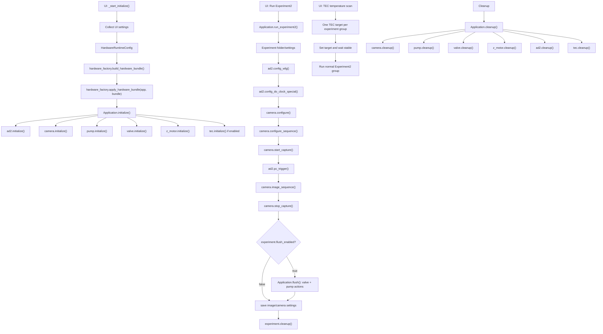

# Current Workflow Audit and Safety Boundary

This document captures the current Python control workflow and the safety
boundary before any LabVIEW acoustic output is run. It is documentation only;
it does not authorize new hardware actions.

## Document Status

This audit is a point-in-time workflow/safety document. It should be read
together with `docs/claude_code_change_log.md` for later implementation
history and `docs/labview_migration_completeness_audit.md` for LabVIEW
migration-parity questions. Later sessions migrated the AD2 DO-clock/LED
timing path into the experiment workflow, so older "DO clock is
legacy/nonessential" wording in this document has been refreshed below.
For the consolidated live list of items that should remain outside the active
workflow until explicitly resolved, see `docs/known_open_items.md`.
`docs/legacy_unresolved_items.md` is the focused high-risk safety summary. For the TEC-specific validation matrix and
official-source boundary, see `docs/tec_verification_matrix.md`.

**Evidence boundary:** code paths and fake-only tests cited below are current
repository evidence. The "Historically Reported Hardware Milestones" section is retained
historical operator evidence and was not rerun in this documentation/audit
pass; it must not authorize a new real-hardware action by itself.

## Canonical Python Flow

Current canonical experiment execution is `Application.run_experiment2()`.
`Experiment2.flush_enabled` defaults to `False`; direct/manual `flush()` is
available and can still move pump and valve when real backends are connected.
The current working tree rejects zero or negative flush flow before either
device is touched; this workflow is a positive-rate dispense operation.

## UI Runtime Boundary

- `qt_ui.py` (`MainWindow`) is the default operator UI and owns the normal
  UI-to-`Application` path.
- `qt_ui_v2.py` (`MainWindowV2`) is an opt-in **transitional UI**, not a
  simulated sandbox or second hardware stack. It subclasses `MainWindow`,
  reuses the same widget builders and shared `Application` instance, and can
  therefore initialize the same real hardware backends when its real toggles
  are selected. Its layout has not been independently hardware-verified. Its
  initialization path now delegates to `Application.initialize()` with
  progress reporting rather than maintaining a second device-order loop.
- In the current working tree, both tracked GUI initialization paths refuse to
  construct a replacement hardware bundle if cleanup of the existing bundle
  reports a failure. This is fail-closed reinitialization: a timed-out vendor
  call may still be alive in its daemon thread, so proceeding to open another
  handle would not be a safe recovery.
- `qt_ui_v3.py` and its launcher/tool/test companions are tracked and formally
  accepted as repository content by explicit owner decision as of the current
  commit. It is an opt-in layout derivative of v2, not a separate runtime or
  the default operator UI, and it has not been independently hardware-verified.
  V1 remains the default; v2 remains the rollback/reference path.
- V3 replaces several silent caption-search loops with
  fail-loud unique-caption adapters that assign stable `objectName` values.
  Initialization, status, acquisition, and MSO adaptations use those validated
  adapters. The shared manual-WFG builder now also assigns neutral stable IDs
  to its carrier/trigger/FM labels and preview description, and v3
  addresses those IDs directly instead of rewriting labels by substring or
  position. Other panels are rebuilt in v3 and therefore remain maintenance
  coupling points when v1/v2 behavior changes.
- Current assessment: v3 inherits the shared repeat-boundary Abort behavior,
  live piezo `MaxTravel` bounds, motion confirmations, and Qmix
  auto-clear-on-initialize/final-fault-gate policy. Its Abort access is menu-only
  rather than a prominent run-control button, and its rebuilt Pump & Valve panel
  omits v1/v2's separate manual Qmix fault-recovery action. These are documented
  divergences, not evidence that v3 has independent hardware validation.
- A backend owns cleanup of resources opened during its own `initialize()`
  before that method returns successfully. Application rollback remains
  responsible for devices whose initialization already completed. Current
  local fixes close a successfully opened pump backend if its initial fill
  readback fails, and stop polling/shut down a piezo channel if post-connect
  readback fails. TEC failed-initialize and direct cleanup now use the same
  bounded `run_with_timeout()` utility as the other timeout-guarded cleanup
  paths; a timeout is reported rather than treated as a successful close.
- The Camera tab is not wholly independent of experiment setup: its
  master-pulse and trigger-polarity/delay sequence fields are copied into each
  `Experiment2.sequence_settings` record when a series is built. The
  experiment builder then explicitly overrides trigger source to `Internal`.
  This retained coupling is current behavior, not a claim that all manual tabs
  are isolated from the canonical path.
- Enabling Z-stage during initialization opens the real PPC001/Kinesis
  connection and reads device state only. It does not authorize or command
  motion. PPC001 movement remains confined to the separately confirmed
  manual Z-Scan calibration workflow.
- Commit `7c7e19f` contains an executable pyMeCom client path, but
  its historical bench-verification claims have not been independently
  reconciled. Its five named parameter IDs do match the installed pyMeCom table
  and official TEC-Family protocol; that source check is not authorization for
  real operation. Simulated TEC remains the only approved default.
- Confirmation flags such as `CONFIRM_REAL_HARDWARE` and the timing
  acknowledgement protect staged scripts in `hardware_tests/`; they are not a
  global application interlock. After real backends are initialized, the
  canonical GUI can invoke WFG, pump, valve, and experiment actions without
  those command-line confirmations. Treat that as an unresolved operator-
  safety boundary, not as a gate already enforced by the GUI.

## LabVIEW-to-Python Mapping

| LabVIEW-derived item | Current Python location | Current status |
| --- | --- | --- |
| Application initialize/cleanup | `src/thermo_acoustic/application.py` | Active Python path |
| Hardware construction | `src/thermo_acoustic/hardware_factory.py` | Active; preserves existing runtime behavior |
| Experiment2 sequence | `Application.run_experiment2()` | Active canonical path |
| Hamamatsu camera acquisition | `HamamatsuCamera` + `HamamatsuDcamBackend` | Camera path validated |
| AD2 WFG configuration | `AD2Sdk.config_wfg()` | Low-risk path validated; acoustic timing not fully confirmed |
| AD2 PC trigger | `AD2Sdk.pc_trigger()` | Present in run path; interaction with `trigsrcNone` needs confirmation |
| AD2 DO Clock Special | `config_do_clock_special()` and DO settings | Active migrated DIO1 LED timing path; staged scripts are gated, canonical GUI is not confirmation-gated |
| AD2 DO Custom | `config_do_custom()` and custom DO settings | Legacy/nonessential unless later evidence requires it |
| Qmix/neMESYS pump | `CetoniPump` + `QmixPumpBackend` | Real backend is opt-in and fault-fails-closed; current bench initialization is blocked by a relatching `0x81FF` CAN Tx Queue Overrun; canonical GUI has no separate movement-confirmation gate after initialization |
| Valve position 1/2 | `Valve.set_position(1/2)` | Mapping unresolved; do not switch yet |
| Flush | `Application.flush()` | Gated by `flush_enabled`; positive dispense rate required before hardware is touched; real pump/valve behavior remains bench-unverified |
| Legacy Prior Z-stage | Retained migration reference only; no active factory path | Obsolete for current PPC001 hardware |
| Thorlabs/APT discovery | `thorlabs_apt.py` passive discovery | Discovery-only; no motion |
| PPC001 manual Z-scan | `qt_ui.py` Z-Scan tab + `thorlabs_piezo.py`/`piezo_zscan.py` | Manual, separately authorized calibration-motion feature; outside the canonical experiment sequence and passive APT discovery |
| TEC temperature scan | `TecController` + `TemperatureSeries` | Disabled/simulated by default; the committed real-path implementation and retained bench claims are not independent authorization, so real operation is not established by this audit |

## Active vs Legacy Classification

| Feature | Classification | Reason |
| --- | --- | --- |
| Hamamatsu camera | Active | Real camera-only and LabVIEW camera preset smoke tests passed |
| AD2 low-risk WFG | Active | Open-close and low-risk CH0 output passed historically; staged scripts are gated, manual GUI output is not separately confirmation-gated |
| AD2 LabVIEW acoustic candidate | Candidate, script-gated only | Frequency/amplitude known, timing and duration risks remain; canonical GUI does not enforce the staged-script acknowledgement |
| AD2 PC trigger | Active in workflow, unresolved semantics | `trigsrcNone` may start output during WFG config instead of PC trigger |
| AD2 DO Clock Special | Active | Migrated as the DIO1 LED timing path derived from Camera FPS / Camera Start / Frames; no independent GUI confirmation gate |
| AD2 DO Custom | Legacy/nonessential | Do not run unless later evidence shows it is required |
| Qmix pump discovery | Historically validated standalone; currently blocked | One-pump config previously passed discovery/readback, but the current controller state relatches `0x81FF` on a fresh bus session |
| Qmix pump flow | Active manual capability, unresolved operational boundary | Real flow is reachable after real initialization; no separate GUI confirmation gate protects ordinary movement controls |
| Valve COM/position mapping | COM port confirmed | Valve confirmed on COM5 (real-hardware status-query response, corroborated by an earlier session too -- COM6 was a standing documentation error, not this session's own artifact); position 1/2 effects not confirmed |
| Flush | Disabled by default | Can move pump and switch valve when enabled |
| Prior COM7 Z-stage | Legacy/obsolete | COM7 absent and current hardware is APT USB |
| Thorlabs/APT passive discovery | Discovery-only | APT Piezo Controller serial `44533854` found by passive enumeration |
| PPC001 Z-scan calibration | Manual, separately authorized motion | GUI Z-Scan tab can connect to the PPC001 and, after a dedicated motion confirmation, move it for calibration; it is not part of `Application.run_experiment2()` or the passive APT discovery helper |
| TEC temperature scan | Unresolved, simulated by default | One target per group; commit `7c7e19f` contains an executable client and source-checked named mapping, but retained bench claims are not independently reproducible, so real operation remains unapproved |

## Risk Table

| Area | Current risk | Interlock / current boundary |
| --- | --- | --- |
| Camera | Low after validation | Camera-only path can run with pump/valve/Z disabled |
| AD2 WFG | Medium to high for acoustic settings | Staged acoustic scripts require confirmation and timing acknowledgement; the canonical GUI does not enforce those flags |
| AD2 PC trigger | Medium | WFG start timing vs `pc_trigger()` is not fully confirmed |
| AD2 DO clock | Medium/high | Active DIO1 LED timing path; timing should still be checked against the physical setup before broad use |
| AD2 DO custom | Unknown/high | Legacy/nonessential; remains disabled unless separately justified |
| Pump/Qmix initialize | Medium/high while current fault remains | Real backend selection is opt-in and pre-existing faults fail closed; the current controller relatches `0x81FF` and must be diagnosed in the CAN/QmixElements layer before initialization is trusted |
| Pump flow | High | Real movement is reachable from the GUI after initialization and has no separate confirmation gate |
| Valve position 1/2 | High | Do not switch until COM/position mapping is verified |
| Flush | High | Disabled by default; can move pump and valve when enabled |
| Prior Z | High/invalid | COM7 is not present; do not use for current Z-stage |
| Thorlabs/APT passive discovery | Medium | Discovery-only helper still does not enable/home/move/jog/poll/settings |
| PPC001 manual Z-scan | High | Manual GUI feature can poll, switch to ClosedLoop after confirmation, then requires a second explicit motion confirmation before moving the piezo; keep outside canonical experiment workflow |
| TEC temperature control | Medium/high | Disabled/simulated by default; commit `7c7e19f` contains a real-client implementation, but retained bench claims still require independent human review (model/firmware compatibility is CLOSED -- see `docs/tec_verification_matrix.md`'s "Model / Firmware / Protocol Compatibility Review") |

## Historically Reported Hardware Milestones

- Hamamatsu camera discovery/open-close passed with camera `C15440-20UP`.
- Real camera-only smoke passed.
- LabVIEW camera preset passed with exposure `40 ms`, ROI
  `horizontal_offset=0`, `vertical_offset=792`, `horizontal_size=2304`,
  `vertical_size=740`, and `1000` frames.
- AD2 discovery/open-close passed.
- AD2 low-risk output passed on CH0 with `1000 Hz` sine, `0.1 V` amplitude,
  `0 V` offset, and `0.5 s` duration.
- Combined real camera + real AD2 low-risk smoke passed through
  `Application.run_experiment2()` with `flush_enabled=False`.
- Qmix/neMESYS one-pump discovery/readback passed with the current one-pump
  configuration path.
- Thorlabs/APT passive discovery found an `APT Piezo Controller`, serial
  `44533854`.
- PPC001/PFM450(E) manual Z-scan support exists as a separate, explicitly
  motion-authorized calibration path in the GUI. It is not part of the canonical
  experiment sequence and must not be confused with the passive
  `thorlabs_apt.py` discovery helper; ClosedLoop mode alone is not permission to
  move the stage.
- TEC temperature-series scaffolding exists as an opt-in path: one target is set
  and stabilized before each experiment group. It remains disabled and simulated
  by default. Commit `7c7e19f` contains pyMeCom real-path
  code whose named parameter mapping is source-checked, plus historical
  real-hardware claims that are not independently reproducible from the repo;
  this audit does not treat either as authorization for real use.

## Do Not Run Yet

- Full LabVIEW acoustic output: CH0 `1.975 MHz`, `2 V`, `60 s`.
- Pump/Qmix active initialization in the main workflow.
- Pump flow, aspirate, dispense, dosing, reference, calibration, or fault-clear.
- Valve switching on real hardware.
- `Application.flush()` with real pump and valve.
- Prior COM7 Z-stage path.
- PPC001/Z-scan motion as part of the canonical experiment workflow.
- Any Thorlabs/APT or PPC001 motion outside the dedicated manual Z-Scan path,
  its explicit ClosedLoop-switch confirmation when needed, and its separate
  explicit PPC001 motion confirmation.
- Real TEC operation until the committed executable client, source-checked
  mapping, and retained bench record receive human review. Model/firmware
  compatibility is CLOSED -- see `docs/tec_verification_matrix.md`'s
  "Model / Firmware / Protocol Compatibility Review".
- Independent AD2 DO Custom output. DO Clock Special is structurally wired for
  DIO1 LED timing, but its physical timing remains unverified and must not be
  treated as proven synchronization.
- Combined camera + full LabVIEW acoustic output.

**DO Clock caveat (do not conflate these two facts, Session 43):** DO
Clock Special is populated from real UI values -- `qt_ui.py`'s
`_experiment_do_clock_config()` builds a real `DoConfig` from
`exp_camera_fps`/`exp_frames`/`exp_camera_start`, passed unconditionally
into `config_do_clock_special()` -- this has been true since before this
session and is not new. That is a *structural/wiring* fact, separate from
  whether the resulting DIO1 pulse timing is correct on the physical setup,
  or how it relates to the separately reported DIO0 acoustic path, remains
  **unverified against an oscilloscope**. The current Python experiment DO
  configuration creates DIO1 only; it does not configure DIO0. The item stayed
  on this list, and the Risk Table entry
below still reads "timing should still be checked against the physical
setup before broad use," for that second reason -- being populated from
real settings does not mean the timing itself has been confirmed.

## Required Before Acoustic Expansion

Before any LabVIEW acoustic candidate output is run beyond the short gated AD2
smoke, clarify whether the current AD2 `config_wfg()` call starts output
immediately when the trigger source is `trigsrcNone`, or whether output waits
for `pc_trigger()`. CH2/index 1 is a LabVIEW screenshot candidate only; its
purpose is unknown and it remains disabled in staged smoke code.
