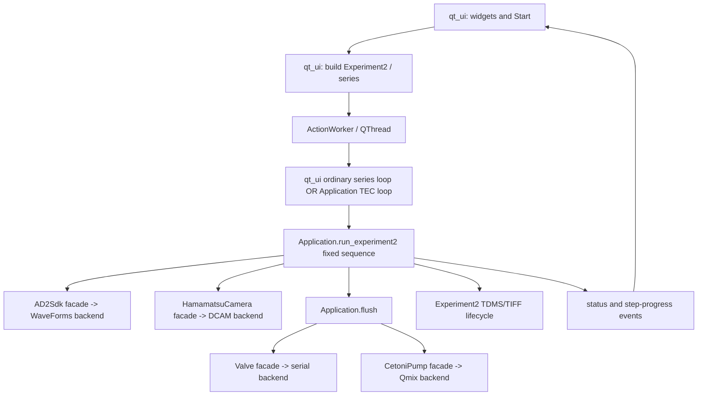
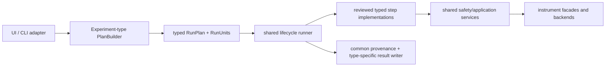

# Experiment Architecture Boundary Assessment

> **Historical pre-cutover architecture assessment.** Its baseline predates the
> implemented `ExperimentRequest` / immutable `RunPlan` authority and explicit
> legacy adapter. Use [`project_control.md`](project_control.md) for current
> architecture. Preserve this body as the evidence and proposal trail.

Read-only assessment prepared against `junjiebranch` at commit `2c0ffc6`
(2026-08-26), with live code citations revalidated at `a3d000f` (2026-08-27).
This document proposes boundaries; it does not authorize or implement a
refactor. Current source is treated as the execution truth. The
LabVIEW field transcription and changelog are used only as historical/parity
evidence, and their uncertainty is retained where the compiled LabVIEW wiring
could not be recovered.

## Executive conclusion

The application already has reusable instrument facades and several reusable
safety operations, but it does **not** yet have a reusable experiment
orchestration boundary. Today:

- Qt owns parameter-to-domain translation, repeat expansion, the ordinary
  series loop, and one of the two graceful-stop boundaries.
- `Application` owns a fixed seven-step `Experiment2` sequence and the TEC
  wrapper loop.
- `Experiment2` owns one workflow-specific TDMS schema as well as output-file
  lifecycle.

A second structurally different experiment would therefore require either
copying this path across UI/Application/workflow code or adding type branches
through all three layers. Both choices expose hardware-safety fixes to drift.

The recommended eventual boundary is a **typed experiment recipe and shared
lifecycle runner**:

1. a UI-independent plan builder translates parameters into typed run units;
2. each run unit composes a small set of centrally implemented, typed steps;
3. one runner owns progress, errors, output lifecycle, and graceful stop at a
   declared safe unit boundary; and
4. instrument facades/backends continue to own device-specific validation,
   fault policy, and SDK calls.

This should not become an unrestricted, data-driven workflow language. Step
implementations and safety ordering remain reviewed Python code. Experiment
recipes may select and order only those typed operations.

The production path should **not** be migrated yet. Qmix/CAN behavior, pump and
flush mechanics, valve routing, and camera/AD2 trigger timing are still partly
unverified. Refactoring before those observations would destroy the ability to
attribute a later discrepancy to the existing behavior versus the refactor.

## 1. Current orchestration path

### 1.1 Boundary map

This is consistent with the repository's prior canonical-flow map, which also
names `Application.run_experiment2()` as the canonical executor
([current_workflow_audit.md:25-72](current_workflow_audit.md#canonical-python-flow)).

### 1.2 Trigger, construction, and dispatch

1. **Operator trigger and collision guard.** `MainWindow._start_experiment()`
   reads the series path, detects existing `data.tdms`/TIFF output, and asks for
   confirmation before overwrite
   ([qt_ui.py:3900-3933](../src/thermo_acoustic/qt_ui.py#L3900),
   [qt_ui.py:3935-3938](../src/thermo_acoustic/qt_ui.py#L3935)). This method
   also branches between the ordinary and TEC-series paths.

2. **Parameter translation and expansion.** `_build_experiment_series()` is a
   UI method, not an application/workflow method. It reads Qt widgets, validates
   frequency-count versus repeat-count, expands repeats, constructs per-repeat
   WFG and DO configurations, chooses output folders, and creates each
   `Experiment2`
   ([qt_ui.py:3940-4015](../src/thermo_acoustic/qt_ui.py#L3940)). Frequency
   scan values are expanded linearly in another UI method
   ([qt_ui.py:3465-3487](../src/thermo_acoustic/qt_ui.py#L3465)); FM sweep
   Start/Stop is translated to typed center/width settings at
   [qt_ui.py:3489-3507](../src/thermo_acoustic/qt_ui.py#L3489).

3. **TEC expansion.** `_build_temperature_experiment_groups()` creates one
   ordinary `ExperimentSeries2` per temperature point by recursively calling
   the ordinary builder
   ([qt_ui.py:4060-4078](../src/thermo_acoustic/qt_ui.py#L4060)). The typed
   temperature parameters and validation live in `TemperatureSeries`
   ([workflows.py:74-175](../src/thermo_acoustic/workflows.py#L74)).

4. **Background execution.** Both paths are submitted through `_run_action()`.
   `ActionWorker` invokes an action with a progress emitter and reports either
   a result or exception
   ([qt_ui.py:619-633](../src/thermo_acoustic/qt_ui.py#L619)); `_run_action()`
   owns the QThread, busy guard, optional timeout, signal connections, and
   worker cleanup
   ([qt_ui.py:4409-4454](../src/thermo_acoustic/qt_ui.py#L4409)).

### 1.3 Series and graceful-stop ownership

5. **Ordinary series loop is in Qt.** `_run_experiment_series_body()` installs
   the series on `Application`, resets the stop event, loops the shared queue,
   checks `stop_fired` between repeats, calls `Application.run_experiment2()`,
   and calculates average FPS
   ([qt_ui.py:4230-4303](../src/thermo_acoustic/qt_ui.py#L4230)).

6. **TEC series loop is in `Application`.** The UI wrapper calls
   `Application.run_temperature_series()` once
   ([qt_ui.py:4158-4228](../src/thermo_acoustic/qt_ui.py#L4158)). That method
   loops temperature points, checks `stop_fired` at the temperature-point
   boundary, applies and stabilizes TEC, then drains every repeat in the point's
   `ExperimentSeries2`
   ([application.py:852-937](../src/thermo_acoustic/application.py#L852)).

7. **Abort request originates in Qt.** `_abort()` sets the application's stop
   event and chooses user-facing wording based on whether the safe unit is a
   repeat or a full temperature point
   ([qt_ui.py:4328-4360](../src/thermo_acoustic/qt_ui.py#L4328)). The ordinary
   loop and TEC loop therefore implement the same policy in different modules.
   The changelog records that this split already caused a real omission: the
   first repeat-boundary fix did not reach the TEC loop, so TEC Abort initially
   did nothing until separately repaired
   ([claude_code_change_log.md:6316-6353](claude_code_change_log.md#session-80----tec-temperature-scan-abort-closes-a-gap-session-78s-non-tec-abort-fix-didnt-reach)).

### 1.4 Per-repeat execution

8. **Fixed step model.** `application.py` defines one global seven-step order:
   InitializeExperiment, ConfigureWfg, ConfigureCamera, CaptureFrames,
   WaitForAd2Completion, Flush, SaveResults
   ([application.py:44-67](../src/thermo_acoustic/application.py#L44)).
   `_report_step()` standardizes progress and exception reporting around those
   blocks
   ([application.py:70-94](../src/thermo_acoustic/application.py#L70)).

9. **Input dequeue and preflight record.** `run_experiment2()` dequeues from
   the application's concrete `ExperimentSeries2`, calculates the AD2
   completion budget, snapshots simulated/enabled states and pump-recovery
   history, creates the output folder/TDMS, and saves requested settings
   ([application.py:617-668](../src/thermo_acoustic/application.py#L617)).
   The completion-time guard rejects continuous/non-finite AD2 timing before
   the workflow can proceed to flush/save
   ([application.py:371-459](../src/thermo_acoustic/application.py#L371)).

10. **AD2 and camera configuration.** The application configures WFG and DIO,
    reads back the post-clamp/achieved configurations, and updates metadata
    ([application.py:670-713](../src/thermo_acoustic/application.py#L670)). It
    then applies real camera exposure, sequence/trigger settings, global
    exposure, and the exposure/readout timing budget
    ([application.py:715-742](../src/thermo_acoustic/application.py#L715),
    [application.py:402-448](../src/thermo_acoustic/application.py#L402)).

11. **Capture and trigger sequence.** Once the repeat starts, camera capture is
    started, one AD2 PC trigger is issued, frames are acquired, and camera stop
    is guaranteed through `finally`. The remaining AD2 completion time is then
    awaited
    ([application.py:744-800](../src/thermo_acoustic/application.py#L744)).
    This is sequencing logic. The individual SDK-facing operations remain in
    the instrument facades: for example AD2 configuration is exposed by
    `AD2Sdk` ([instruments.py:205-276](../src/thermo_acoustic/instruments.py#L205))
    and camera configuration/capture/save by `HamamatsuCamera`
    ([instruments.py:603-703](../src/thermo_acoustic/instruments.py#L603)).

12. **Optional flush.** When enabled and both pump and valve are enabled,
    `run_experiment2()` calls the shared `Application.flush()` and records its
    result; failure stops the series
    ([application.py:801-831](../src/thermo_acoustic/application.py#L801)).
    `flush()` itself owns the safety checks and fixed physical sequence:
    capacity/current-fill checks, positive dispense rate, confirmed P01, pump
    target move and bounded wait, confirmed P02, post-wait, and final target
    command
    ([application.py:530-615](../src/thermo_acoustic/application.py#L530)).
    Device behavior remains below it in `CetoniPump` and `Valve`
    ([instruments.py:765-930](../src/thermo_acoustic/instruments.py#L765),
    [instruments.py:948-1065](../src/thermo_acoustic/instruments.py#L948)).

13. **Save and completion.** Image/TIFF saving, image metadata, camera readback,
    experiment cleanup, and final status happen at
    [application.py:833-850](../src/thermo_acoustic/application.py#L833).
    `Experiment2` owns output-folder creation, requested/applied settings,
    flush outcome, image names/timestamps, TDMS serialization, and post-write
    verification
    ([workflows.py:178-339](../src/thermo_acoustic/workflows.py#L178),
    [workflows.py:455-545](../src/thermo_acoustic/workflows.py#L455)).

14. **UI completion.** Progress signals update queue count, waveform, FPS,
    active/abort state, and step state
    ([qt_ui.py:4507-4588](../src/thermo_acoustic/qt_ui.py#L4507)); worker
    completion records success/error and restores controls
    ([qt_ui.py:4615-4628](../src/thermo_acoustic/qt_ui.py#L4615)).

### 1.5 Where parameters enter and are consumed

| Parameter family | Entry/translation | Consumption |
| --- | --- | --- |
| Series path, repeats, frequency scan | Qt widgets; expanded in `_build_experiment_series()` ([qt_ui.py:3940-3984](../src/thermo_acoustic/qt_ui.py#L3940)) | Queue shape, per-repeat folder, per-repeat WFG frequency |
| WFG/FM sweep | Qt state -> typed `WfgConfig`/`FmSweepSettings` ([qt_ui.py:3408-3507](../src/thermo_acoustic/qt_ui.py#L3408)) | AD2 configure/readback and TDMS ([application.py:670-713](../src/thermo_acoustic/application.py#L670)) |
| Camera FPS/start/frame count | Qt -> per-repeat `DoConfig` ([qt_ui.py:4080-4111](../src/thermo_acoustic/qt_ui.py#L4080)) | AD2 DIO, camera timing preflight, frame count |
| Camera sequence/trigger | Manual-camera widgets are copied into each automated experiment, then `trigger_source` is forcibly replaced with `Internal` ([qt_ui.py:3989-4008](../src/thermo_acoustic/qt_ui.py#L3989)) | Camera configuration ([application.py:715-742](../src/thermo_acoustic/application.py#L715)) |
| Flush | Experiment widgets -> `FlushSettings` ([qt_ui.py:3519-3533](../src/thermo_acoustic/qt_ui.py#L3519)) | `Application.flush()` safety and motion sequence |
| TEC points/stability | Qt text/spins -> `TemperatureSeries` ([qt_ui.py:4017-4026](../src/thermo_acoustic/qt_ui.py#L4017)) | Outer point loop and TEC controller |
| Live hardware facts | `Application.run_experiment2()` reads facade state and achieved AD2/camera values | TDMS provenance and applied-value metadata |

The LabVIEW experiment panel contains the same broad parameter families—series
path, camera timing, WFG values, repeat/frame counts, dynamic camera start,
global exposure, and flush settings
([labview_ui_field_reference.md:146-168](labview_ui_field_reference.md#ui_tabs05-experimentpng----experiment-tab)).
Historical parity tracing found that LabVIEW populated a `SequenceSettings`
cluster during experiment creation and passed it through `RunExperiment2.vi` to
camera configuration; the actual compiled value of some fields remains
unrecoverable
([claude_code_change_log.md:363-371](claude_code_change_log.md#session-19----camera-trigger-source-re-investigation-labview-diagram-trace-still-unresolved--dcam-readout-timing-bounds-check-implemented)).

## 2. Invariant versus variant

The classification is about responsibility, not whether the current code is
already located in the right module.

| Current stage/responsibility | Classification | What actually varies / evidence |
| --- | --- | --- |
| Hardware connection mechanism, per-device rollback, Qmix fault policy, SDK bounds | **INVARIANT** | An experiment may select a different subset, but it must not redefine how a selected device connects or validates. Current independent initialization is centralized at [application.py:225-285](../src/thermo_acoustic/application.py#L225); Qmix auto-clear plus final fault gate is centralized at [qmix_backend.py:137-214](../src/thermo_acoustic/qmix_backend.py#L137) and [qmix_backend.py:263-288](../src/thermo_acoustic/qmix_backend.py#L263). |
| Which devices are required/optional/unused | **VARIANT-BY-CONFIGURATION** for a known recipe | Device participation is a declarative property of an experiment type, not a reason to duplicate device code. The current `enabled` flags already gate AD2/camera/flush calls, but there is no experiment-level manifest. |
| Output collision confirmation and background-worker isolation | **INVARIANT** | Folder collision protection and worker exception/progress marshaling do not depend on scientific sequence. |
| Parameter parsing, units, and construction of WFG/DO/flush/TEC settings | **VARIANT-BY-CONFIGURATION** where the same operation is used | Frequencies, durations, frame counts, flow/volume, and target temperatures can be typed data. Unit translation must remain centralized rather than repeated per UI. |
| Repeat expansion and discrete frequency substitution | **VARIANT-BY-CONFIGURATION** | The current algorithm changes per-repeat values but not the step structure. LabVIEW parity work describes Dynamic Frequency as per-repeat substitution parallel to Dynamic Camera Start ([claude_code_change_log.md:292-296](claude_code_change_log.md#session-14----frequency-scanning--dynamic-frequency-investigation-no-code-changes-not-implemented)). The exact LabVIEW linear-spacing semantics remain partly inferred. |
| Ordinary repeat versus TEC temperature point nesting | **VARIANT-BY-STRUCTURE** | TEC adds set-target, stable wait, optional hold, then an entire repeat group. Its safe abort unit is the whole temperature point, not one inner repeat ([application.py:865-935](../src/thermo_acoustic/application.py#L865)). |
| Configure WFG, configure DIO, configure camera | **VARIANT-BY-STRUCTURE** as participation/order; **VARIANT-BY-CONFIGURATION** within an included operation | A camera-only or pump-only experiment should omit unrelated configuration, but an included configure operation should consume typed settings and the same central validation. |
| Camera-start -> PC-trigger -> acquire -> camera-stop ordering | **VARIANT-BY-STRUCTURE** | This ordering is specific to the current acquisition recipe. Whether the camera should be internally free-running or externally paced is still unresolved, so it cannot yet be promoted as a universal capture primitive. |
| AD2 completion-budget calculation and refusal of continuous output before later steps | **INVARIANT** for any recipe that requires “AD2 completes before proceeding” | The derived duration is configuration; the fail-closed validation is safety policy and must not be copied. |
| Flush implementation | **INVARIANT reusable composite operation**; inclusion and placement are **VARIANT-BY-STRUCTURE** | The 60x timeout correction and valve/pump safety checks belong in one operation. A recipe may omit flush or place it only at a reviewed safe point; it must not rewrite the motion sequence. |
| Graceful-stop principle | **INVARIANT** | A stop request must be honored at a declared safe boundary, never by ad-hoc mid-operation interruption. |
| Definition of the safe abort unit | **VARIANT-BY-STRUCTURE** | Current ordinary unit is a repeat; TEC unit is a full temperature point. A future experiment must declare this explicitly. **UNCLEAR:** future experiment types are not specified, so their safe units cannot be inferred now. |
| Status/error recording and progress lifecycle | **INVARIANT envelope**, with **VARIANT-BY-STRUCTURE** step names | Started/completed/failed/error semantics are shared. A fixed global `STEP_ORDER` is not. |
| Git hash, workflow identity/version, simulated/enabled device state, fault-recovery provenance, outcome | **INVARIANT metadata envelope** | These are provenance for every run. Current TDMS already records most device/pump facts, but not a generic workflow identity. |
| Scientific settings and result payload | **VARIANT-BY-STRUCTURE** | Different experiments will have different parameter/result schemas. Forcing them all into `Experiment2._settings_properties()` would create sparse, misleading fields. |
| TDMS as the required format and `Experiment`/`ImageData` as the required schema for every future experiment | **UNCLEAR** | Current workflow and LabVIEW parity require it. No evidence states that every future non-imaging experiment must emit identical groups/channels. Do not assume. |
| Cleanup after a unit versus whole-session device cleanup | **INVARIANT lifecycle concepts**, details **VARIANT-BY-STRUCTURE** | Camera capture must stop in `finally`; output must be finalized. Whole hardware cleanup remains an application/session concern. A future step may acquire another scoped resource. |

## 3. Current coupling that blocks composition

1. **Qt is both view and experiment factory.** The only complete mapping from
   operator parameters to `Experiment2` lives in `MainWindow` and reads widgets
   directly. A headless caller or another UI must reproduce that translation.
   A second experiment type would add another large UI builder or conditionals
   inside `_build_experiment_series()`.

2. **Qt owns one execution loop while `Application` owns another.** Ordinary
   repeat looping is at [qt_ui.py:4230-4303](../src/thermo_acoustic/qt_ui.py#L4230);
   temperature-point looping is at
   [application.py:852-937](../src/thermo_acoustic/application.py#L852).
   This already allowed the Abort semantics fix to reach one path but miss the
   other. A third nesting mode would have no obvious owner.

3. **`Application` is typed to one concrete queue and record.** The application
   field is `ExperimentSeries2`, its getter/setter expose that type, and
   `run_experiment2()` dequeues from application-global mutable state
   ([application.py:98-105](../src/thermo_acoustic/application.py#L98),
   [application.py:200-204](../src/thermo_acoustic/application.py#L200),
   [application.py:617-621](../src/thermo_acoustic/application.py#L617)). A
   second type must either masquerade as `Experiment2`, add another queue and
   executor, or introduce `isinstance`/`if type` branches.

4. **One method mixes lifecycle, policy, sequence, and payload.**
   `run_experiment2()` performs queue mutation, safety preflight, metadata,
   device configuration, acquisition, timing, flush, persistence, and status.
   Reusing only its capture portion or replacing flush with another structural
   step is not possible without copying or branching the method.

5. **The progress model encodes the current workflow globally.** `STEP_ORDER`
   is imported by the UI and assumed by breadcrumb state
   ([application.py:54-67](../src/thermo_acoustic/application.py#L54),
   [qt_ui.py:617-626](../src/thermo_acoustic/qt_ui.py#L617)). A future workflow
   with different steps will either show the wrong model or force global
   branching.

6. **Abort boundary is inferred from UI mode flags.** `_abort()` decides its
   message from `_temperature_scan_active`; the runner does not expose an
   explicit safe-unit contract. Adding another workflow would add another UI
   condition even though stop policy belongs with execution structure.

7. **Persistence is a workflow record pretending to be a generic workflow
   module.** `workflows.py`'s `Experiment2` knows current WFG, DO, camera, flush,
   TEC, and pump-fault fields. Adding a structurally different record will make
   this class grow optional fields or cause a copied writer. The useful generic
   part—atomic output lifecycle and post-write verification—is not separated
   from the current schema.

8. **Automated camera settings depend on manual-tab widget state.** The builder
   copies `_camera_sequence_settings()` from the manual camera surface because
   the experiment tab has no separate fields, then overrides a subset
   ([qt_ui.py:3989-4008](../src/thermo_acoustic/qt_ui.py#L3989)). This is hidden
   cross-panel coupling, not a UI-independent experiment definition.

9. **Device participation is inferred from live facade flags.** There is no
   plan-level “required/optional/unused” declaration. A requested flush with a
   disabled pump/valve is silently classified as skipped and distinguished only
   in metadata/status ([application.py:823-831](../src/thermo_acoustic/application.py#L823)).
   Different future workflows may require different fail/skip rules, which
   should be declared and validated before execution rather than added as more
   branches inside the fixed sequence.

10. **Safety fixes are correctly centralized only below parts of the current
    orchestration.** Examples include the flush timeout formula in
    `FlushSettings.timeout_s`
    ([workflows.py:52-71](../src/thermo_acoustic/workflows.py#L52)), flush safety
    and routing sequence in `Application.flush()`, and the current Qmix
    auto-clear/final-gate policy in `QmixPumpBackend.initialize()`. A copied
    workflow could bypass any of them by redoing the apparently simple
    arithmetic or SDK sequence. The v3 panel omission and the prior TEC Abort
    omission demonstrate that cross-check discipline does not reliably prevent
    this class of drift.

## 4. Proposed boundary

### 4.1 Target responsibilities

#### A. UI adapter versus plan builder

**UI side:** widgets, dialogs, display conventions, and conversion into a plain
typed parameter object.

**Experiment side:** a UI-independent `PlanBuilder` validates cross-field rules
and expands parameters into a `RunPlan`. Each experiment type owns its parameter
schema and builder. It does not receive Qt widgets.

**Prevents:** v1/v2/v3 or a CLI independently rebuilding the same scientific
mapping; manual-tab state leaking invisibly into an automated definition.

**Cost/risk:** extracting the existing builder can change unit conversion,
default sourcing, repeat expansion, or settings identity. Frequency scanning
and trigger source still contain parity uncertainty. This touches shared
`qt_ui.py`; v2/v3 inherit its state and would require coordinated UI ownership.

**Incremental:** yes. A plan builder can first be called by the current Qt path
while still producing the exact current `ExperimentSeries2`; old and new output
can be compared in fake-only characterization tests before any executor change.

#### B. Typed run plan and safe unit

A `RunPlan` should contain:

- `workflow_id` and schema/version;
- required, optional, and unused instrument capabilities;
- an ordered collection of typed `RunUnit` objects;
- the unit's human name and safe graceful-stop boundary; and
- output/provenance context.

A `RunUnit` is the indivisible unit once started. For the current plain path it
is one repeat. For the current TEC path it is one temperature point containing
its full repeat group. The runner checks a stop request only between units.

**Prevents:** each wrapper inventing its own abort loop and UI flags. It directly
addresses the Session 78/80 ordinary-versus-TEC drift.

**Cost/risk:** choosing the wrong unit can either delay stop too long or interrupt
unsafe work. Future experiment safe units are **UNVERIFIED** until their physical
sequence is defined.

**Incremental:** yes for representation; no for switching current real execution
until characterization and bench evidence establish equivalent boundaries.

#### C. Reviewed typed steps, not arbitrary commands

Candidate current step types are `ConfigureAd2`, `ConfigureCamera`,
`CaptureFrames`, `WaitForAd2Completion`, `Flush`, `SaveResults`,
`SetTecTarget`, and `WaitTecStable`. A recipe composes these types. It must not
contain raw callables, backend method names, or an unrestricted list of
user-authored device commands.

Each step implementation calls a shared service or facade; for example the
typed `Flush` step must call the one `Application.flush()` implementation, not
restate valve positions, timeout arithmetic, or pump commands.

**Prevents:** copies missing the 60x timeout correction, current-fill check,
valve ready checks, or stop-on-timeout behavior.

**Cost/risk:** overly fine-grained steps could let a recipe assemble physically
unsafe orders; overly coarse steps recreate one monolithic workflow. Composite
safety operations such as Flush should remain indivisible. The correct capture
composite cannot be finalized until trigger timing is measured.

**Incremental:** new typed wrappers can be introduced beside existing methods
and initially delegate to them. Moving existing method bodies is not required
for the first stage.

#### D. Shared lifecycle runner

The runner should own:

- preflight of declared instrument participation;
- stop-event reset and between-unit graceful-stop checks;
- step started/completed/failed progress;
- status/error propagation;
- per-unit output finalization after partial success/failure; and
- final plan outcome.

It should accept the instrument/service context explicitly rather than dequeue
from `Application.experiment_series` global state. The current Qt worker remains
an outer asynchronous adapter; the runner itself should not depend on Qt.

**Prevents:** ordinary/TEC loops diverging; a new workflow forgetting abort,
progress, or partial-result handling.

**Cost/risk:** this is the highest-risk migration because it changes control
flow around working hardware calls. It touches `Application`, `qt_ui.py`, v2/v3
progress rendering, tests, and potentially cleanup semantics.

**Incremental:** add a parallel runner and legacy adapter first. Do not replace
`run_experiment2()` in place. Run it with simulated/fake services and compare
event order, calls, metadata, and failure outcomes before any hardware switch.

#### E. Common result envelope plus experiment-specific schema

**Common side:** workflow id/version, git hash, timestamps, outcome, enabled and
simulated instruments, achieved hardware values, manual/automatic recovery
facts, and error/abort information.

**Experiment side:** scientific settings and payload channels specific to that
type. The current `Experiment2` TDMS shape remains one implementation.

**Prevents:** either copying TDMS verification/provenance code or bloating
`Experiment2` with unrelated optional fields. It also ensures future workflows
cannot omit Qmix recovery provenance merely because their scientific payload is
different.

**Cost/risk:** changing TDMS properties/groups can affect downstream LabVIEW or
analysis consumers. The repo explicitly says no real npTDMS-versus-LabVIEW
round-trip comparison has established every metadata expectation. Preserve the
current schema through a legacy adapter during migration.

**Incremental:** yes, by adding an internal common envelope that serializes to
the existing exact TDMS keys for `Experiment2`. A new experiment may add its own
schema without rewriting the current one.

#### F. Instrument/application boundary remains authoritative

The proposed runner must use `Application` services and instrument facades. It
must not call Qmix/DCAM/WaveForms/serial backends directly. Backend/facade code
continues to own SDK units, live bounds, connection/fault behavior, local
rollback, and readback.

**Prevents:** a recipe silently bypassing the Qmix policy reversal or live device
validation.

**Cost/risk:** some useful orchestration operations are currently private or
typed directly to `Experiment2`; carefully exposing them may require small
service interfaces. This is cross-owned `Application`/instrument work and cannot
be changed unilaterally by a UI owner.

### 4.2 What should not be generalized

- Do not turn raw SDK/backend calls into declarative step names.
- Do not allow arbitrary step ordering for safety composites such as Flush.
- Do not make every field optional on one universal `Experiment` dataclass.
- Do not infer required devices solely from which parameters happen to be
  nonzero.
- Do not make graceful stop mean “call every device stop method.” Current policy
  intentionally completes the safe unit first
  ([claude_code_change_log.md:6139-6154](claude_code_change_log.md#session-78----safety-behavior-change-abort-no-longer-force-stops-hardware-mid-operation----it-now-always-finishes-the-current-repeat-first)).
- Do not move device fault or range policy into experiment recipes.

### 4.3 Ownership/coordination impact

| Proposed work | Shared/cross-owned surface | Coordination required |
| --- | --- | --- |
| Extract current UI parameter adapter | `qt_ui.py`; inherited/reused by `qt_ui_v2.py` and `qt_ui_v3.py` | v1/v2/v3 owners must agree on the typed parameter contract and defaults |
| Introduce plan/recipe types | likely `workflows.py` or a new workflow module | Application and all UI/CLI consumers must review; no unilateral v3 implementation |
| Add lifecycle runner / remove Qt series loop | `application.py`, `qt_ui.py`, v2/v3 progress state | High coordination; changes abort and error boundaries |
| Create typed shared steps | `application.py`, instrument facades | Hardware owners must review every operation and ordering constraint |
| Preserve/evolve TDMS envelope | `workflows.py`, downstream analysis/LabVIEW expectations | Data-owner review and compatibility tests required |
| Render workflow-specific progress | v1/v2/v3 UI code | UI-specific presentation may diverge, but must consume one shared runner state |
| Qmix, valve, camera, AD2, TEC internals | `qmix_backend.py`, `instruments.py`, `tec.py`, hardware backends | Explicitly outside experiment-type ownership |

### 4.4 Alternative: do not restructure yet

**This is the better short-term trade.** The current workflow is partly
hardware-verified and partly not. A structural refactor now would create a
second explanation for every future bench discrepancy.

If only one small additional experiment is needed before verification closes,
the least-risk temporary approach is an explicit high-level recipe that calls
existing shared `Application` operations and facades, with a written cross-check
matrix for initialization, bounds, fault policy, abort, progress, persistence,
and cleanup. It may duplicate a small amount of high-level ordering, but it must
not duplicate Qmix initialization, flush math/sequence, camera timing checks, or
device SDK calls.

This alternative becomes worse rapidly as experiment types or nesting modes
multiply. The v3 recovery-control omission and TEC Abort omission demonstrate
that “remember to cross-check copies” is not a sufficient long-term safety
boundary. It is acceptable only as a deliberate bridge while behavior is being
verified, not as the target architecture.

## 5. Sequencing recommendation

### Phase 0 — now: preserve and characterize; no production refactor

- Keep this assessment under owner review.
- Before future architecture work, add characterization tests (in a separate,
  explicitly authorized task) for exact current call order, enabled/disabled
  device behavior, progress events, stop boundaries, partial output, TDMS keys,
  and failure outcomes. Existing tests cover parts of this but should be treated
  as a behavior lock, not proof of hardware correctness.
- Define candidate names/contracts on paper. Do not introduce unused production
  abstractions merely to claim the architecture has started.

Reason: current unverified behavior must remain attributable to the existing
path.

### Phase 1 — close Qmix/valve/pump evidence before abstracting fluidics

Wait for:

1. QmixElements/VCI inspection of the CAN fault and adapter state;
2. stable connection evidence under the owner-approved auto-clear policy;
3. a deliberately small, authorized pump physical verification; and
4. P01/P02 physical routing plus the complete flush sequence observation.

The current policy clears a fault during normal connection but still fails if
it remains/relatches; it is approved connection behavior, not proof that the CAN
root cause is gone
([hardware_repair_plan.md:13-56](hardware_repair_plan.md#qmix-can-fault)).
Valve mapping and full pump/flush verification remain explicit open steps
([hardware_repair_plan.md:137-169](hardware_repair_plan.md#valve-p01--p02-routing)).

Only after those checks should `Application.flush()` be wrapped as a stable
typed composite or its caller boundary be moved. Do not refactor
`QmixPumpBackend.initialize()`, fault policy, `CetoniPump`, or `Valve` as part of
experiment architecture.

### Phase 2 — close trigger evidence before defining a reusable capture step

Scope DIO1, camera exposure/trigger output, and PC trigger; record delay,
frequency, pulse count, and physical wiring. The current code forces DCAM
`Internal`, configures DIO1, and issues one PC trigger, but does not prove those
events synchronize
([hardware_repair_plan.md:105-129](hardware_repair_plan.md#minimal-evidence-needed),
[the current open-item registry](known_open_items.md#current-registry); the
assessment's original line-specific registry reference is preserved by its Git
baseline rather than by today's compact live register).

Only after the measurement should the project name and freeze a typed capture
composite. Otherwise an abstraction would give an unresolved sequence a false
appearance of correctness and reuse it across new experiments.

### Phase 3 — introduce additive contracts alongside the legacy path

After Phases 1-2 establish the physical meaning of the current steps:

1. introduce typed parameter and plan objects;
2. make a UI-independent builder reproduce the current
   `ExperimentSeries2`/`Experiment2` objects exactly;
3. keep `run_experiment2()` as the only real-hardware executor;
4. compare old/new plans under fakes and retained presets; and
5. add workflow identity/version to an internal result envelope while
   serializing the current TDMS schema unchanged.

This phase touches `qt_ui.py` and `workflows.py`, and therefore requires UI,
Application, and data-owner coordination.

### Phase 4 — parallel runner, fake-only and shadow verification

Implement the shared runner and typed steps beside the legacy executor. Use
fake/simulated instruments to prove:

- identical current call and progress order;
- identical requested/applied metadata;
- identical flush-failure and camera-error outcomes;
- identical ordinary and TEC graceful-stop boundaries; and
- no backend access outside facades/services.

Do not delete or rewrite the legacy executor in this phase.

### Phase 5 — controlled migration and new experiment types

Switch the current workflow only after owner review of the complete diff and a
small staged hardware re-verification of the now-known Qmix/valve/pump and
camera/AD2 behavior. Keep a rollback path to the legacy executor until that
verification passes. Once the current workflow runs through the shared runner,
add the next experiment type as a new parameter schema + plan builder + recipe,
reusing the same services and lifecycle.

TEC should remain isolated/simulated unless its separate real-operation review
authorizes it. New experiment architecture is not authorization to expand TEC,
stage, pump, valve, camera, or AD2 hardware scope.

## Decision summary

- **Target architecture:** typed recipes composed from reviewed shared steps,
  one lifecycle runner, instrument facades/backends retained as the sole
  hardware boundary, common provenance plus type-specific results.
- **Immediate action:** none beyond review/characterization planning.
- **Short-term posture:** keeping the existing executor is safer than refactoring
  unverified behavior.
- **Long-term posture:** high-level duplication is not acceptable once multiple
  experiment types exist; the project has already demonstrated that safety
  behavior drifts across copied presentation and loop paths.
- **Explicit unknowns:** future experiment safe-unit boundaries, universal
  output-format requirements, correct physical camera/AD2 trigger relationship,
  valve fluidic meaning, and Qmix CAN root cause.
